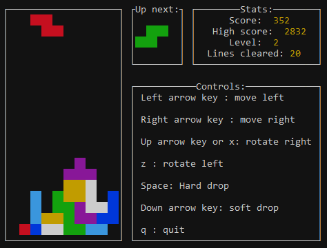

## It's tetris time!

A tetris implementation for the terminal written in C++ with ncurses.
The source code is under the MIT liscence so feel free to clone and contribute if you want.

### Building
Install dependencies:   
`sudo apt install gcc-11 g++-11 libncurses5-dev libncursesw5-dev` 
Then simply run make.
